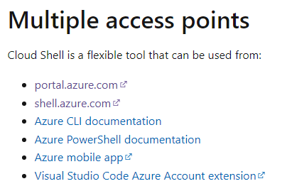
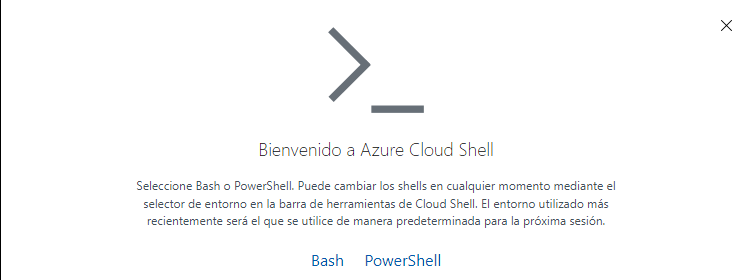
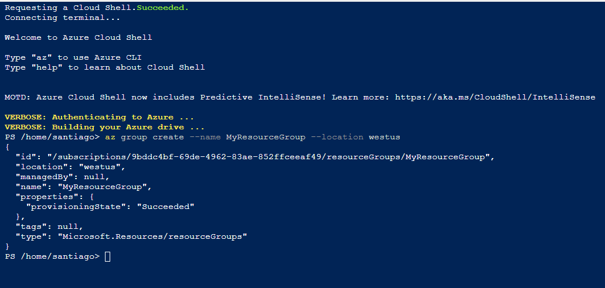
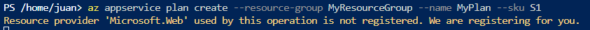
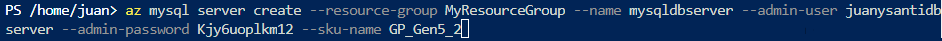

# LABORATORIO 6 AZURE 
## Santiago Arévalo Rojas y Juan Felipe Sánchez Pérez
### Exercise 1: Creating Azure Web App and MySQL database
1. Seleccionar shell.azure.com:

PowerShell:
  
Ingresamos a la terminal, y escribimos el siguiente comando para desplegar a un grupo de recurso:  
  
Para crear un plan de servicio de aplicación:
   
Para crear la aplicación web con nombre único:
  
Para crear el MySQL server con un nombre único:  
  
