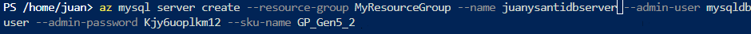
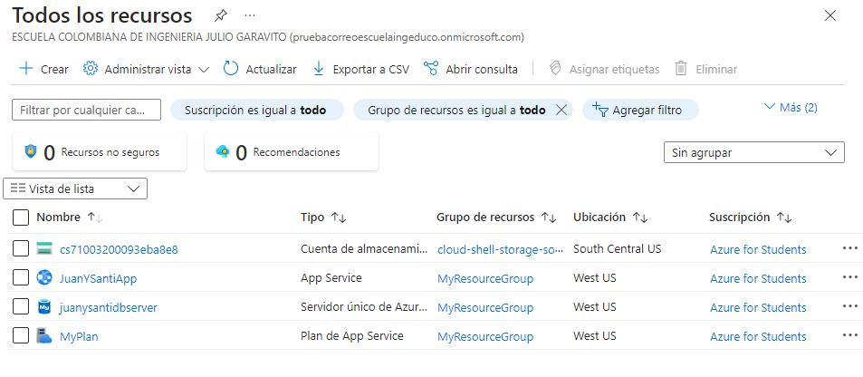
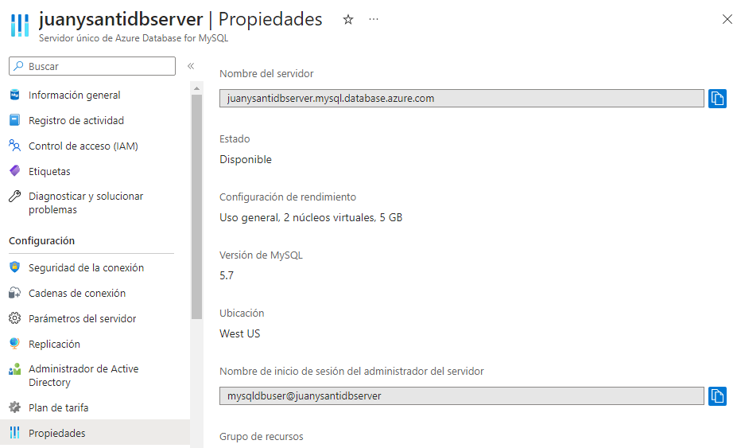
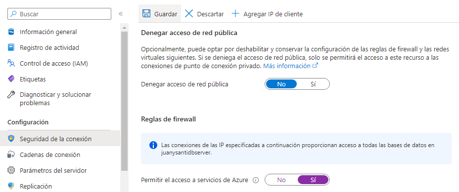

# LABORATORIO 6 AZURE 
## Santiago Arévalo Rojas y Juan Felipe Sánchez Pérez
### Exercise 1: Creating Azure Web App and MySQL database
1. Seleccionar shell.azure.com:

PowerShell:
  
Ingresamos a la terminal, y escribimos el siguiente comando para desplegar a un grupo de recurso:  
  
Para crear un plan de servicio de aplicación:
   
Para crear la aplicación web con nombre único:
  
Para crear el MySQL server con un nombre único:  
  
En la sección de todos los recursos, observamos la creación de la base de datos:
  
Se selecciona la base de datos, y en el apartado de propiedades, se observa el nombre del servidor y Nombre de inicio de sesión del administrador del servidor.  
  
Ahora en el apartado de seguridad de la conexión, permitimos el acceso a los servicios de Azure y guardamos, para que puedan interactuar con las bases de datos del servidor MySQL:
  
Ahora en la sección de todos los recursos, seleccionamos la aplicación web, y en configuración, seleccionamos la pila de Java, con la versión 8, y con el servidor web de Jaba Apache Tomcat 9.0. Finalmente guardamos:  
   
Seleccionar introducción, y luego examinar, abriendo la página web:
 
